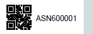
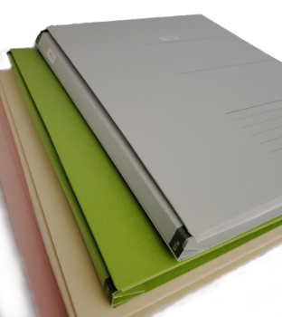
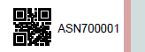
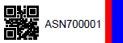
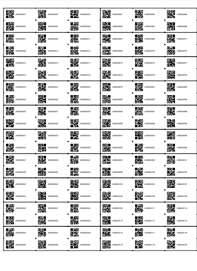
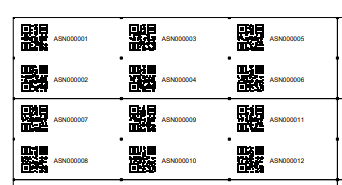

# ASN Label Generator


This is a tool to create ASN Labels to use for document management systems such as [Paperless-ngx](https://docs.paperless-ngx.com/). The [recommended workflow](https://docs.paperless-ngx.com/usage/#usage-recommended-workflow) of Paperless-ngx uses QR codes for ASN (archive serial number) labels.


This Python based CLI tool outputs a PDF for printing on the label sheets. 


## Features

Besides generating ASN labels with a QR Code the tool can also

* combine multiple labels on one physical label on the sheet  
  _This is helpful for small label sizes even though your physical label cutout sizes are bigger._

* support custom number ranges  
    _This can be useful if you want to use different folders and number ranges for yourself (ASN**0**0001), your partner ASN**2**0001, your kids (ASN**4**0001), etc._
    
* add a color bar to the side of the labels to allow easier visual identification where the label belongs to  
    _I use expandable folders with different colors to store the physical documents for me, my wife and the kids, i.e. one color per person_  
    _e.g. blue for person A, green for person B, yellow for person C_

    

    

* add another color bar (highlight color) to mark important docs      
    _e.g. blue + red for important (long term storage) documents of person A_

    


### Example usage of ASN labels with colors:

| number ranges | Meaning                                | Color      |
| ------------ | --------------------------------------- | ---------- |
| 000000       | Me - normal docs (shorter term storage) | blue       |
| 100000       | Me - imporatant  (long term storage)    | blue/red   |
| 200000       | Wife - normal                           | green      |
| 300000       | Wife - important                        | green/red  |
| 400000       | Child 1 - normal                        | yellow     |
| 500000       | Child 1 - important                     | yellow/red |
| ...          | ...                                     | ...        |


## Getting started

### Usage

This tool is hightly flexible, almost all parameters can be controlled from the command line.

Other Avery (or competitor's) label sizes can be added to `labelInfo` in `AveryLabels.py`. 

You can install Python and all dependencies yourself or use Docker.


```
$ ./asn-gen.py -h
Usage: asn-gen.py [OPTIONS] [filename]

ASN Label Generator

Arguments:
  filename                          output filename of PDF file generated

Options:
  -l, --labeltype=STR               Type of label, e.g. 4731, get a list of supported labels with --labels (default: 4731)
  -n, --number=INT                  number of labels to generate (default: 189)
  -o, --offset=INT                  Number of labels to skip on the first sheet (e.g. already used) (default: 0)
  -d, --num-digits=INT              Number of digits for the ASN, e.g. 000001 (default: 6)
  -s, --first-asn=INT               First ASN to use, e.g. 100001 (default: 1)
  -f, --font-size=STR               Fontsize with a unit, e.g. 2mm, 0.4cm (default: 2mm)
  -q, --qr-size=FLOAT               Size of the QR-Code as percentage of the label hight (default: 0.9)
  -m, --qr-margin=STR               Margin around the QR-Code with a unit, e.g. 1mm (default: 1mm)
  --sub-labels-x, --lx=INT          How many labels to put on a phyical label horizontally (default: 1)
  --sub-labels-y, --ly=INT          How many labels to put on a phyical label vertically (default: 1)
  --debug                           enable debug mode
  --position-helper                 enable position helpers, e.g. as cutting guides when using sub labels
  --bar-width, --bw=INT             Show a colored bar on the right of the label (0 = no bar) (default: 0)
  --bar-color, --bc=STR             Color of the bar, HEX notation (default: d2dede)
  --highlight-bar-width, --hw=INT   add a colored highlight bar on the right of the label (0 = no bar) (default: 0)
  --highlight-bar-color, --hc=STR   Color of the highlight bar, HEX notation (default: d9a4a6)
  -p, --prefix=STR                  Prefix to the actual ASN number (default: ASN)

Other actions:
  -h, --help                        Show the help
  --labels                          Shows a list of supported labels
  --version                         Show the version
```

#### Testing your printer settings
Use ``--debug`` and ``--position-helper`` to test your printer settings.  
_**Recommendation:** do test prints on normal paper before printing to the actual label sheets._

_**Note**: Make sure to set print size to 100%, not fit to page or similar._


### Running the program from CLI

You'll need Python 3 on your system.

To install all dependencies use 

`` pip install -r requirements.txt `` 

Depending on your configuration either use

`` ./asn-gen.py ... ``

or 

`` python3 asn-gen.py ... ``

### Running the program from Docker

If you don't want to install python and the dependencies on your machine you can use Docker.
There is a handy bash script :

`` ./ag-docker.sh <output directory> [normal parameters to asn-gen.py] ``

e.g. `` ./ag-docker.sh $(pwd)/out -s 500001 ``

_Note: when using docker you cannot specify the output filename. Instead the default scheme will be used._


### Output Filename Scheme
If the filename is omitted the output defaults to

`` label-<labeltype>-<prefix>-<first-asn>-<first-asn+number>.pdf ``

e.g. 

`` label-4731-ASN-000001-000190.pdf ``


## Examples


### List supported labels

To get a list of supported labels use 

`` ./asn-gen.py --labels ``

Currently: 3044, 4731, 5160, 5161, 5163, 5167, 5371, 4778, 100984

### Simple 4731 label with color bars

To generate labels for a Avery L4731 sheet with a bar (blue) and a highlight bar (red) starting with ASN 700001 use:

`` ./asn-gen.py --bw 8 --bc 0000ff --hw 3 --hc ff0000 -s 700001 out/labels-700001.pdf ``

  
_(I'd recommend using more pleasant colors for yourself ;) )_


### L5161 labels with multiple labels per physical label (cutting required) 
To generate labels for a 5161 sheets with 6 labels on one physical label (1 sheet with 120 ASN labels) use:

`` ./asn-gen.py -l 5161 --lx 3 --ly 2 -n 20  --debug --position-helper``  

_**Recommendation:**_ `` --position-helper `` _will add small dots in the corners of (sub-)labels. This can be useful as subtle sublabel cutting guides._

`` --debug `` will show the box around the physical labels.


  
_Output filename: label-5161-ASN-000001-000021.pdf_  

  


## Credits

This project is based on [work by gitolicious](https://github.com/gitolicious/avery-asn/tree/main) but was heavily modified to support CLI and some additional features. That project itself is based on the [work from timrprobocom](https://gist.github.com/timrprobocom/3946aca8ab75df8267bbf892a427a1b7)